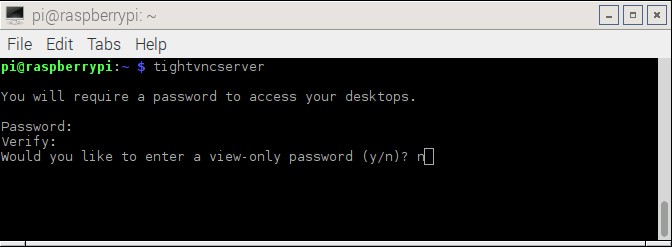
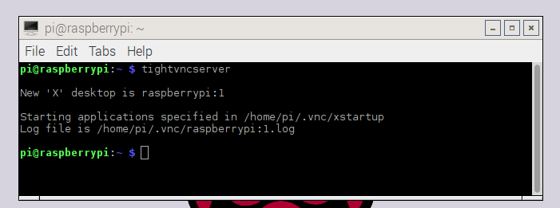

# Remote working on Raspberry Pis

## Option 1 Remote with VNC

So long as your Raspberry Pis are networked (either via WiFi or a Network Switch), you can operate them remotely from any existing networked computer.
**V**irtual **N**etwork **C**omputing is a protocol that allows you to control one computer from another computer. The advantage of using VNC is that you gain access to the full desktop of the Raspberry Pi, meaning you can use graphical programs from the connected computer.

- First you will need to install a VNC server onto the Raspberry Pi. Open up the terminal and type:

``` bash
sudo apt-get install tightvncserver
```

- With the sever installed you need to start it running

``` bash
tightvncserver
```

- You'll need to create a password at this point.



- When the VNC server starts it will tell you which desktop you can use. Normally this will be `:1` but maybe a different number



- Now you can use another computer to control the Raspberry Pi. Depending on the OS of the client machine, there are a variety of apps you can use.

- You might find it useful to have the tightvncserver start every time the Raspberry Pi boots. To do this, you'll need to be `root` so open a terminal and type:

``` bash
sudo su
```
- Next you need to navigate to the directory /etc/init.d/:

``` bash
cd /etc/init.d/
```
- Create a new file for the boot script.

``` bash
nano vncboot
```
- Then copy and paste the following script into the editor

``` bash
#! /bin/sh
# /etc/init.d/vncboot

### BEGIN INIT INFO
# Provides: vncboot
# Required-Start: $remote_fs $syslog
# Required-Stop: $remote_fs $syslog
# Default-Start: 2 3 4 5
# Default-Stop: 0 1 6
# Short-Description: Start VNC Server at boot time
# Description: Start VNC Server at boot time.
### END INIT INFO

USER=pi
HOME=/home/pi

export USER HOME

case "$1" in
 start)
  echo "Starting VNC Server"
  #Insert your favoured settings for a VNC session
  su - $USER -c "/usr/bin/vncserver :1 -geometry 1280x800 -depth 16 -pixelformat rgb565"
  ;;

 stop)
  echo "Stopping VNC Server"
  /usr/bin/vncserver -kill :1
  ;;

 *)
  echo "Usage: /etc/init.d/vncboot {start|stop}"
  exit 1
  ;;
esac

exit 0
```
- To exit nano type `ctrl+x`. Hit `Y` to confirm the save and exit.

- Now you need to make the file executable

``` bash
chmod 755 vncboot
```

- Then enable dependency-based boot sequencing:

``` bash
update-rc.d lightdm remove
update-rc.d vncboot defaults
```

- If enabling dependency-based boot sequencing was successful, you will see this:

``` bash
update-rc.d: using dependency based boot sequencing
```

- Now reboot your Raspberry Pi and you should find a VNC server already started.

- To connect to the Raspberry Pi from another computer, you can follow the instructions in one of the links below:

[On Windows](vnc-windows.md)  
[On OS X](vnc-osx.md)  
[On Chrome OS](vnc-chromeos.md)  
[On iOS](vnc-ios.md)  

- *Note* - currently software such as Minecraft, Picamera (preview) and omxplayer will not work over VNC. [RealVNC are working on an experimental server to rectify this.](https://github.com/RealVNC/raspi-preview)

## Option 2 - Remote with SSH

If your students do no need access to a Graphical User Environment, then SSH is an easy way of connecting to and using, Raspberry Pis.

### *nix Operating Systems
- If your students are using OS X or a Linux based OS, then SSH is native to the Operating System. Simply open up a terminal and type:

``` bash
ssh pi@10.10.10.10
```

- Don't forget to use the IP address of the Raspberry Pi.
- Then you can type in the password when prompted (usually `raspberry` unless you have changed it).

### Chrome OS and Chrome browser

- If your students are using Chrome OS or have access to the Chrome browser, then there is a Chrome App that allows access over SSH. You can find the [Secure Shell App in the Chrome Web Store](https://chrome.google.com/webstore/detail/secure-shell/pnhechapfaindjhompbnflcldabbghjo?hl=en).

- Once installed, click on the App to open it.

- Now you can access the Raspberry Pi by typing in the IP address

- Then type in the password


### Putty (On Windows)

- Putty is an app that provides a Secure Shell on Windows.
- Download Putty from [here](http://www.chiark.greenend.org.uk/~sgtatham/putty/download.html)
- Once installed, you can open Putty from the Start Menu and type in the IP address

- If it is your first time connecting to this Raspberry Pi, you'll get a warning dialogue box, so click `Yes` to connect.

- Then you need to enter the username and password for the Raspberry Pi (usually `pi` and `raspberry`)


