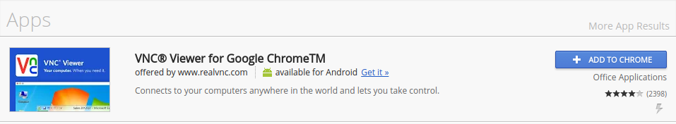
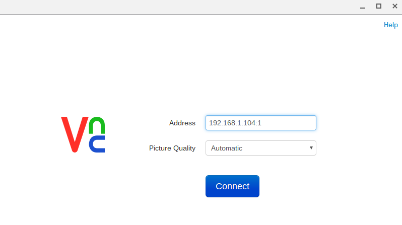
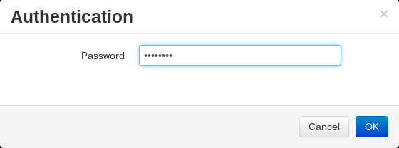
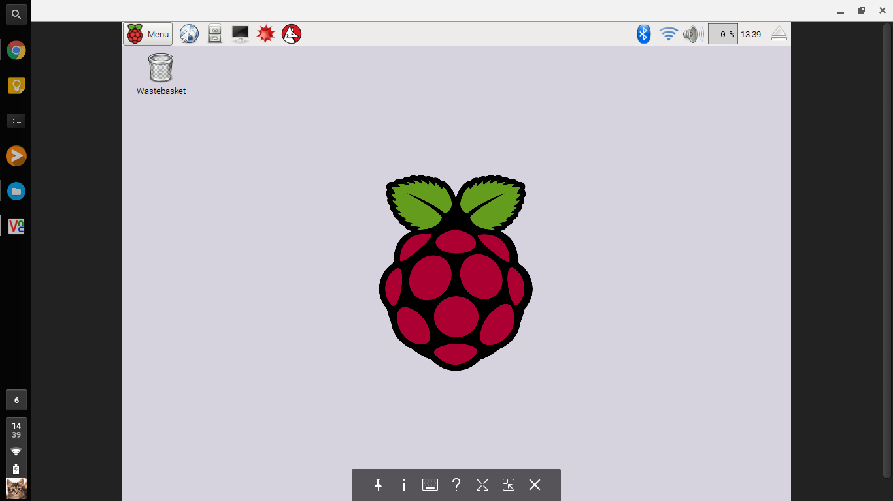

# VNC with Chrome OS
You'll need an App from the Chrome Web Store to use VNC on a chrome book
1. In the Chrome Web Store search for VNC Viewer for Google Chrome and add the application to chrome

2. With the App open, you can type in the IP address and desktop number for the Raspberry Pi

3. Enter the password at the prompt

4. You should now be connected to the Raspberry Pi

