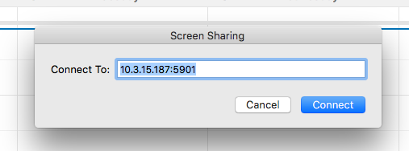
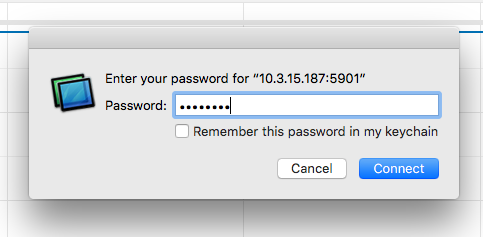
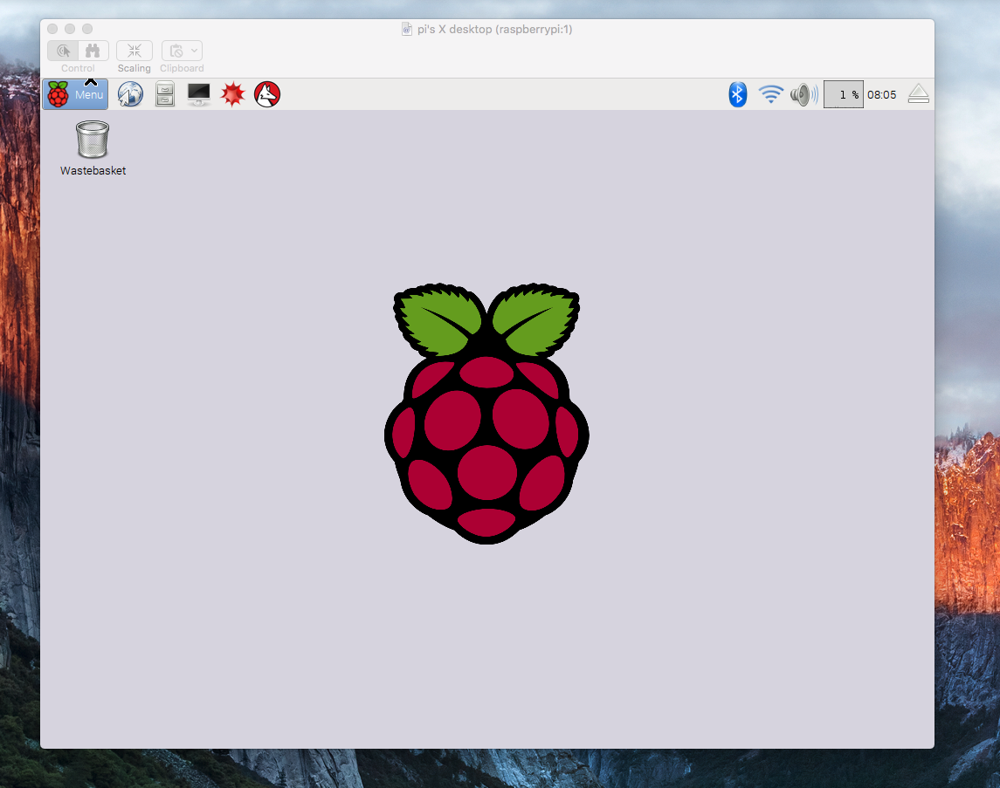

# VNC with OS X

OS X has a built in VNC client that you can use to easily connect to the Raspberry Pi.
- Open up Safari and go to the URL bar. Here you can type in `vnc://10.10.10.100:5901`, but using the IP address of the Raspberry Pi. The port number is always `590X` where X is the virtual Desktop you noted earlier.

- A dialoge box will appear asking you to confirm the connection

- Then a second dialogue box will ask for a password

- Now you should be remotely connected to the Raspberry Pi

