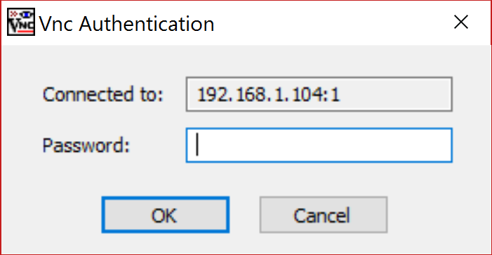

# VNC with Windows

- You can download a vnc viewer from [here](http://www.tightvnc.com/download.php)
- Once tightvnc is installed load the application from the Start Menu and type in the IP address followed by the desktop number (`:1`) in the below example.

- You should then be prompted for the password you used.

- Once connected, you should see a window containing the Raspberry Pi Desktop.

